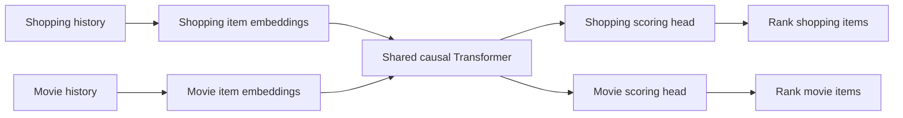

# Hongyi's neural recommender workstream

Updated 25 September 2026. **Confirmed by Hongyi:** his contribution concerns the modern deep-learning recommender. The architecture and protocol below are recommendations awaiting selection, not completed work or team decisions.

## Validation of the three assumptions

| Claim | Verdict | More precise statement |
| --- | --- | --- |
| Modern deep recommenders essentially do continual learning | Too broad | Deep learning specifies the model family. Continual learning specifies how its learned parameters are updated over a succession of data batches/tasks. A neural model can be trained once, periodically retrained, or continually updated. |
| These systems are pretrained and then learn on the fly after deployment | A valid deployment pattern, not a definition | Initial offline training can be followed by incremental training on newly collected interactions. Updates can be periodic; each prediction need not perform a gradient update. |
| We can initially train on A, then interleave B with expected A data during continued learning | Yes, as a deliberately chosen experiment | Warm-start the same model and change the domain composition of its update stream. Specify shared parameters, compatible training examples, update budget and a fixed A evaluation. |

Prefer **initial offline training** to “pretraining” here. Pretraining is not technically forbidden, but can suggest a foundation model or a distinct representation-learning objective that this experiment does not require.

A user's new click can change the history supplied to a frozen network and therefore change its recommendations. That is not itself weight learning. Likewise, recomputing a user representation or refreshing a retrieval index does not establish that model weights were updated. Periodic retraining from scratch also differs from continuing the existing checkpoint.

Monolith provides a concrete production example: historical batch training is followed by streaming training, with a training service periodically synchronizing parameters to serving. The distinction matters: serving requests and updating weights are separate operations. This supports the plausibility of our chosen lifecycle, not a claim that every modern recommender operates that way. [Liu et al., 2022, §2.2](https://ceur-ws.org/Vol-3303/paper8.pdf)

## Recommended framing

**Original-domain retention during continual updates of a neural recommender under a controlled change in domain mixture.**

Draft question:

> After initial training on shopping interactions, how does the proportion of a second domain in subsequent training affect shopping recommendation quality, while the model learns that second domain?

Call B “a second domain” or “a shifted training distribution.” It is out of the initial A distribution, but becomes part of the training distribution once introduced. “OOD robustness” alone can suggest evaluation on unfamiliar inputs without updating the model. Different-domain observations are not inherently rubbish, malicious, or low quality.

This is an offline simulation of continued model updates. It does not require a live service or Kafka infrastructure, and it cannot measure feedback effects created by real users reacting to the model's recommendations.

## Proposed neural model

Start with a **small SASRec-based sequential recommender**, conditional on the selected datasets providing meaningful ordered interactions. SASRec uses self-attention to predict the next item from past interactions. It is an established neural baseline from 2018, not a claim of current state of the art. [Kang and McAuley, 2018](https://arxiv.org/abs/1808.09781)

For two domains with separate catalogues, the proposed adaptation is:

The known request domain selects the applicable head; outputs are not mixed. These domain-specific interfaces are our proposed modification, not a claim about the original SASRec architecture or a mitigation already shown to work.

Let `theta` denote shared Transformer parameters and `phi_A`, `phi_B` the domain-specific embeddings/scoring parameters. For domain `d`, score candidate `i` given history `h` as:

`s_d(h, i) = q_phi_d(i)^T f_theta(E_phi_d(h))`.

Both domains update `theta`, so B can change how A histories are represented even when A's item embeddings are untouched. Domain-specific heads alone do not protect A from this route of interference. Domain routing and separate heads also restrict the claim: this evaluates within-domain ranking, not a unified shopping-and-movie feed.

Preserve domain-specific IDs and each real user/session history. **Interleave training examples or batches, not unrelated users' histories into fabricated shopping–movie sequences.** Cross-dataset user matching is unnecessary for this proposed shared sequence encoder. If datasets lack meaningful order, consider a feature-based two-tower model instead; do not invent temporal structure merely to use a Transformer.

An item-ID-only model does not explicitly receive genre, actor or product-category semantics. It learns patterns in interactions. Claims about semantic knowledge require actual metadata inputs or additional evidence.

## Formal training protocol

The detailed v0.1 specification is now [CONTINUED-TRAINING.md](CONTINUED-TRAINING.md), added 27 September. It defines batch/example accounting, optimizer-state handling, test isolation and pseudocode. Its concrete proposed defaults refine the earlier outline below; neither document represents completed implementation or final team approval.

Define training examples as `(domain, history, next-item target)`. Dataset B must supply compatible supervision, not just a list of movie titles. Document how clicks, purchases, views or ratings are mapped to the task; those signals are not automatically equivalent.

**Stage 1:** train on initial A data to obtain a checkpoint `Theta_0`. Use validation data to choose hyperparameters. Save the checkpoint and optimizer-state policy. Allocate B's parameters with controlled initialization; do not train on B during this stage.

**Stage 2:** create independent continued-training runs from that checkpoint. At update cycle `t`, let `alpha` be the fraction of training examples drawn from B. The intended expected objective is:

`L_t(Theta; alpha) = (1 - alpha) E_[A_t][ell_A] + alpha E_[B_t][ell_B]`.

This expression assumes equally weighted per-example losses, with any extra weighting documented. If supervising multiple target positions per sequence, count valid target positions or normalize explicitly. Domain sampling proportions do not alone determine gradient magnitudes.

Keep `alpha` fixed within each pilot run. Compare `alpha = 0, 0.5, 1`, plus a frozen checkpoint. A later sweep can add intermediate values. Do not increase the ratio sequentially in one run and attribute the resulting differences solely to ratio: that also changes the starting weights and prior exposure.

For each cycle:

1. Read the next A and B update windows under a documented chronology and mixing rule. Artificially combining unrelated datasets is a controlled stream, not evidence of synchronized real traffic.
2. Perform the specified number of mini-batch optimizer updates, preserving the ongoing model state within a run.
3. Evaluate on fixed held-out A examples, with fixed histories, targets, candidate items and filters. Exclude their target interactions from every training/update pool. Use evaluation mode so dropout does not masquerade as retention loss.
4. Measure held-out B quality as well if claiming useful adaptation. Tune on validation sets, not either test set.

Use the same batch size, update count, evaluation checkpoints, loss definitions and sampling policies across mixture runs. Repeat final comparisons with multiple seeds. Clarify whether A updates are fresh interactions or replayed initial examples: the latter is already rehearsal.

## Outcomes and controls

Let `Q_A(alpha, t)` be A's NDCG@10 after cycle `t`, and `Q_A(0_initial)` its value at the initial checkpoint.

- **Retention loss:** `F_A(alpha, t) = Q_A(0_initial) - Q_A(alpha, t)`. Positive means worse than the initial model; negative means improvement. This is our baseline-relative measure, not a claim to use a universal forgetting formula.
- **Mixture comparison:** `C_A(alpha, t) = Q_A(alpha, t) - Q_A(alpha=0, t)`. Negative means worse than the A-only continued-training control at that budget. It need not mean worse than the initial model.
- **Adaptation:** report B's ranking quality alongside A, with its own candidate set. Freezing everything can preserve A while failing to learn B.

Plot A and B metrics versus update count; summarize final A retention versus mixture. Report absolute metrics as well as differences.

The fixed-budget design estimates the practical effect of stream composition. Raising B share also reduces A exposure. To attribute harm specifically to B updates, add an A-exposure-matched control: reproduce the mixed run's A examples, skip its B gradient updates, and index evaluation by the same A exposure. This control intentionally uses less update compute; report that difference. No single comparison simultaneously holds total examples, A examples and B share fixed.

For a targeted mechanism check, branch a B-only run with the shared Transformer and all A parameters frozen, training only B-specific parameters. A outputs should remain unchanged under a fixed deterministic evaluation. Explicitly exclude frozen parameters from weight decay and optimizer updates. This is an isolation control, not evidence of a superior adaptive recommender.

New B item embeddings/head parameters create a cold-start effect as well as a domain shift. Record their initialization and training status; do not attribute all observed degradation to semantic domain distance. If necessary, investigate a separately reported B-interface warm-up with the shared trunk frozen.

## Red-team review of the supplied chat

The shared-parameter intuition is sound; several stronger claims need qualification:

| Reference-chat claim | Correction |
| --- | --- |
| Conflicting gradients can increase shopping loss | Correct locally for a small plain-gradient-descent step; it is not a guarantee about long-run NDCG. |
| Nearly orthogonal gradients mostly do not interfere | Only a first-order statement. Curvature and accumulated updates matter; at an A optimum the A gradient can be small even when movement is harmful. |
| 90% B means B mistakes are nine times more important | It gives a 9:1 sampling/loss coefficient ratio only under the stated equal-weight assumptions, not a 9:1 gradient or business-impact ratio. |
| Adapters reduce interference substantially | A hypothesis for this setup. Trainable shared weights can still disturb A; freezing them changes the adaptation capacity. |
| Any shopping decline after movie training is catastrophic forgetting | First report the measured retention loss and rule out evaluation changes and training instability. Severity is an empirical finding. |
| Negative transfer requires training the combined model from scratch | Too restrictive. Harm from transfer can also occur during fine-tuning; the comparison/control defines the claim. [CCTL](https://arxiv.org/abs/2306.16425) |
| A neural model should be more robust than a classical one | Unproven. Shared neural weights can introduce interference that isolated classical factors avoid. |

For the gradient argument, define gradients over the same trainable shared parameters. With a B step `theta' = theta - eta g_B`:

`L_A(theta') - L_A(theta) ≈ -eta g_A^T g_B`.

This is our mathematical explanation using a first-order Taylor approximation. With an actual optimizer update `delta_theta` (e.g. Adam), the first-order change is `g_A^T delta_theta`; raw gradient cosine alone does not capture momentum/preconditioning. Do not compute gradients on the held-out test set for diagnostics. Use a separate training/diagnostic batch, and treat gradient inspection as optional explanation after the basic experiment works.

## What to read and build first

1. **SASRec:** understand history embeddings, causal attention and next-item scoring. Check that the team's data supports this task before selecting it.
2. **ADER, §3.2 and §4:** a concrete periodic update protocol and replay/distillation reference. It uses SASRec and evaluates the next incoming window after each update, with separate experiments on two e-commerce datasets. It does not mix shopping with movies. Our fixed-A retention test therefore extends its evaluation. Its results also describe limited forgetting when old items recur, so a dramatic collapse is not assured. [Mi, Lin and Faltings, 2020](https://arxiv.org/html/2007.12000v1)
3. **Monolith, §2.2:** supports the production motivation for initial batch training plus continued updates; reproducing its infrastructure is unnecessary for this experiment.

First implementation milestone after model/data selection: train the A-only neural model, save/reload it, reproduce its fixed evaluation score, and verify the update loop on A-only data. Then introduce B with explicit shared parameters. Choose replay or adapters only after obtaining an interpretable baseline; adding both immediately would obscure the initial question.

Hongyi's deliverable is the neural model definition, its initial/continued training pipeline, checkpointed evaluation curves and a defensible account of its behavior. Dataset conventions and evaluation must remain compatible with teammates' work.
