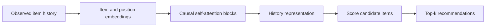
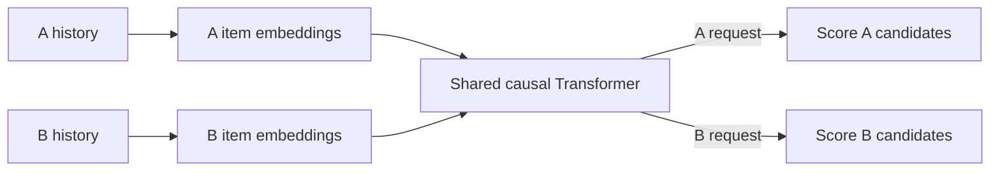
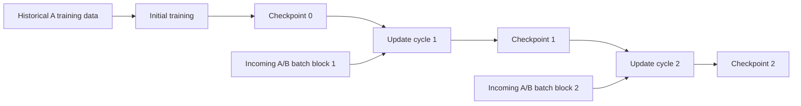
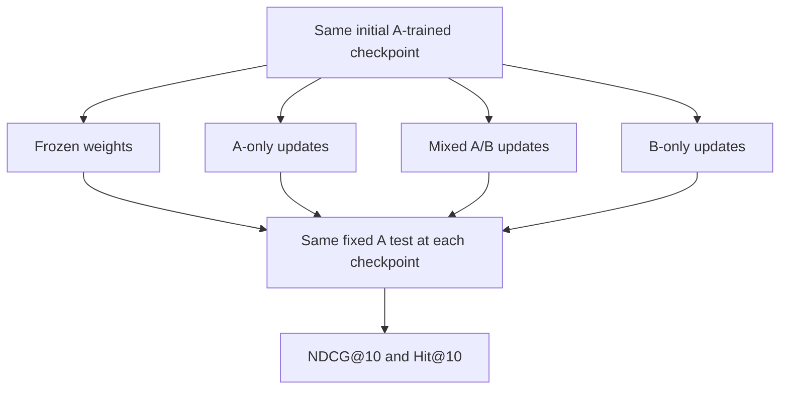

# Modern recommender slide flow

Draft for discussion, 28 September 2026. Hongyi's contribution only. These diagrams describe a proposed experiment, not implemented architecture or results. A and B are placeholder domains. No source PDF changes.

## Story and placement

Question: How does original-domain recommendation quality change when a neural recommender continues training on a changing mixture of interactions?

| Order | Slide title | Purpose | Placement in group deck |
| --- | --- | --- | --- |
| 1 | SASRec next-item recommendation | Establish what the model predicts | Proposed method, expanding p. 5 |
| 2 | Shared model across two domains | Explain how B updates can affect A | Proposed method, conditional on adopting separate domain interfaces |
| 3 | Periodic continued training | Distinguish model architecture from the update protocol | Proposed method |
| 4 | Retention experiment | Show independent controls and fixed evaluation | Proposed evaluation, expanding p. 8 |
| Closing contribution | Neural implementation plan | Actual progress, resources and dated next steps | Existing pp. 6–7 and 9–10 |

Four technical slides are a suggested organization, not a course requirement. The group's abstract and motivation establish the research question before these slides. If the allotted speaking time is tight, move slide 2 to backup and retain its shared-parameter explanation on slide 3. Total slide allocation remains a group decision.

## 1. SASRec next-item recommendation

One message: SASRec uses an ordered history to score the next item.

Speaker note: At inference, the model computes recommendations from the supplied history. Changing that history can change its recommendations while its weights stay fixed. During training, known next items provide supervision for parameter updates. This diagram simplifies SASRec's internal blocks and shows next-item inference.

Source: Kang and McAuley (2018), https://arxiv.org/abs/1808.09781 . The update lifecycle on slide 3 is our experimental addition.

Transition: To study two domains, we must first define what they share.

## 2. Shared model across two domains

One message: Both domains update the same Transformer, providing a route for cross-domain interference or transfer.

On-slide qualifier: Proposed adaptation of SASRec. Dataset compatibility remains to be verified.

Speaker note: A known request domain selects the item interface and candidate set. Domain embeddings and scoring parameters remain separate; proposed input/output embeddings are tied within each domain. Both types of training example update shared Transformer parameters. An A example also updates the A interface, and a B example updates the B interface. Each example retains its real user/session history. We do not join unrelated shopping and movie interactions into a fictitious user's sequence. The diagram shows alternative domain routes through the same model, not simultaneous fusion of A and B histories.

This architecture is our proposed adaptation, not an architecture attributed to the original SASRec paper. The exact interface depends on dataset selection.

Transition: Having defined the shared model, we can specify how its weights evolve.

## 3. Periodic continued training

One message: Each cycle starts from the preceding learned weights.

Speaker note: Continue optimizing the next-item objective on subsequent interaction batches. Preserve learned weights across cycles. The proposed protocol resets Adam once at the transition from initial training and retains its state thereafter. A cycle represents a fixed number of optimizer steps for this experiment, not necessarily one day. Evaluation occurs at checkpoint 0 and after each cycle without updating weights. The frozen control bypasses the update cycles. No live serving system is required.

Source for related precedent: Mi, Lin and Faltings (2020), ADER, https://arxiv.org/abs/2007.12000 . ADER periodically updates SASRec and evaluates subsequent windows. Our fixed-domain retention test and controlled domain mixtures are separate experimental choices.

Transition: We now compare what happens when only the incoming mixture changes.

## 4. Retention experiment

One message: Independent runs start from the same checkpoint and face the same original-domain test.

On-slide captions:

- Same initial weights, A test histories, targets and candidate pool.
- Same total update budget across trained conditions.
- B share is the fraction of supervised next-item examples from B.
- Evaluate B separately to measure adaptation.

Speaker note: The converging arrows denote common evaluation, not combining model weights or predictions. Provisional pilot B shares are 0%, 50% and 100%, with a separate frozen condition. These shares require group agreement because the current PDF instead describes B added relative to a fixed A volume. A 200% B/A volume ratio means a 66.7% B share.

Report two comparisons:

1. Updated A score minus initial A score: change in original capability.
2. Mixed-run A score minus A-only score at the same update budget: effect of the chosen stream composition relative to continued A learning.

Negative values have different meanings for these comparisons. Lower performance than A-only can reflect missed A improvement without a decline from the initial model. Under a fixed total budget, adding B reduces A exposure, so the comparison does not isolate harmful B gradients. An A-exposure-matched control can investigate this further. Include variability across repeated runs. Improvement and no measurable change are valid findings.

For the actual results figure later: x-axis update cycle, y-axis fixed-A NDCG@10, separate lines for the comparison conditions. Do not draw invented declining curves as results. Add a separate B-quality plot when measurements exist.

## Progress and execution material

Contribute to existing group progress/resources/schedule slides rather than repeating this technical explanation.

| Item | Current evidence or proposed next action |
| --- | --- |
| Design preparation | Existing notes specify a candidate model and continuation/evaluation protocol |
| Actual implementation status | Hongyi to confirm work done outside these notes |
| First implementation milestone | Train A, save/reload its checkpoint and reproduce its evaluation |
| Next milestone | Verify A-only continued updates, then add a mixed-domain pilot |
| Dependencies | Dataset choice, domain identity/schema, shared evaluator, actual compute access |
| Schedule | Attach team-agreed dates to milestones before submission |

Do not present the design notes as evidence that experiments have run. Adapters, replay and distillation remain optional extensions after the baseline protocol works.
