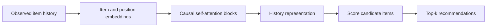
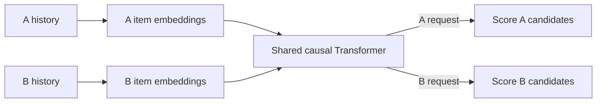
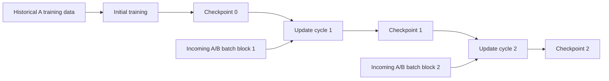
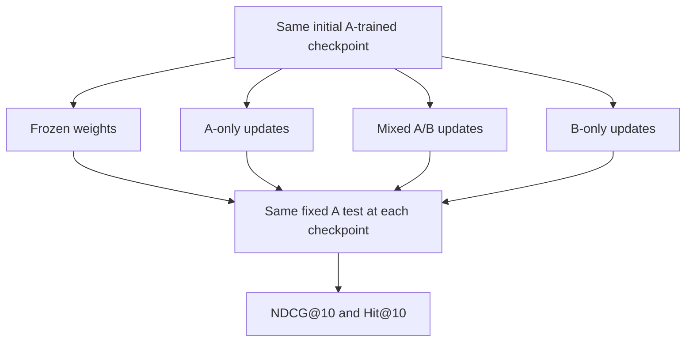

# Modern recommender slide flow

Draft for discussion, 28 September 2026. Hongyi's contribution only. The team deck is edited in [Google Slides](../slides/README.md); this file supplies its neural content. The diagrams below describe a proposed experiment unless a line says it is implemented. They are not results.

## Live deck review — 28 September 2026

Read from the live Google deck's public text export and preview on 28 September; no edits were made to it. Slide numbers are positions in that deck and will shift as it changes. The deck now includes the classical pilot and its results (slides 9–16), which the V1.2 PDF reviewed in [DEFENSE.md](DEFENSE.md) did not. **Every issue found, slide by slide, is in [slides/ISSUES.md](../slides/ISSUES.md).** This section covers only where the neural content goes.

**Slide budget:** the deck has 22 slides. Excluding acknowledgements and references leaves 20, the course maximum. Proposed placement:

1. Slide 7 ("Data — Exploration?", now empty) introduces the dataset for the class. The neural slides depend on it.
2. Slide 8 (the outdated technical plan) becomes N1.
3. Hide the version-history slide before export. That frees one place for N2, directly after N1.

**Open decision to settle before the neural slides quote mix levels:** slides 5, 9, 13 and 15 define mixing as Movies & TV volume relative to Electronics (0–140%). The neural code holds the total update count fixed and specifies B's share of updates. 140% of A is a 58.3% B share. See [DEFENSE.md](DEFENSE.md#resolve-the-mixture-denominator).

### Paste-ready neural slides

Written for a classmate who has not met SASRec, the dataset or the papers, following [the slide principles](../slides/README.md#principles-for-making-slides). Change the wording to your own voice. Every status line reflects the repository on 28 September; update it if that changes.

**N1 (replaces slide 8). Title: "6. Neural — Our second model reads each shopper's history in order"**

- Flow, four boxes left to right: *A shopper's last 50 reviewed products, oldest → newest* → *SASRec [1]: at each step, weighs how much each earlier product should count, looking only backward* → *Score every Electronics product* → *Top 10*.
- Three callouts:
  - **Why this model:** order matters (phone → case → cable). The Markov chain on slide 10 looks only at the latest product; SASRec looks at the last 50.
  - **Built:** the original authors' design [1], rebuilt in PyTorch. Training, saving and reloading (identical scores after reload) and further training on Electronics all run, and are tested on made-up data.
  - **Not yet:** no run on the real Amazon data. Next: Electronics, then mixing in Movies & TV.
- Footer: *Made-up test data checks the software, not the research question. Results on slides 13–16 are for the classical models only.*
- Speaker note: Like the compressed Markov chain (QR), SASRec has a fixed set of internal weights that every prediction uses. In our planned design, Movies & TV training would update those same weights, so it could change Electronics predictions, for better or worse. That is what we will measure.

**N2 (new, after N1). Title: "6. Neural — Every version starts from the same model and faces the same test"**

- Diagram: *Train on Electronics reviews before 2021* → *Saved copy of the model* → three versions: *Frozen: no more training* · *Keeps training on 2021 Electronics reviews* · *Keeps training on 2021 Electronics mixed with Movies & TV* → *After every round of training: the same Electronics shoppers, each with one hidden review, all Electronics products ranked*.
- Caption: *Same starting model · same test shoppers and products · same amount of training for every version that trains.*
- Callout: *Why keep an Electronics-only version? It shows what extra training does on its own. A mixed version can end below Electronics-only without falling below where it started, so we report both gaps.*
- Status line: *Built: frozen and Electronics-only. Not built: the Movies & TV mix.*
- Speaker note: Hidden test reviews are never used for training. Settings are chosen on a separate hidden review, never on the test. See section 4 below for the two comparisons.

## Story and placement

Question: How does original-domain recommendation quality change when a neural recommender continues training on a changing mixture of interactions?

| Order | Slide title | Purpose | Placement in the live deck |
| --- | --- | --- | --- |
| 1 | SASRec next-item recommendation | Establish what the model predicts | Neural slide N1 (slide 8) |
| 2 | Shared model across two domains | Explain how B updates can affect A | Backup, or N1's speaker note; conditional on adopting separate domain interfaces |
| 3 | Periodic continued training | Distinguish model architecture from the update protocol | Neural slide N2 (after N1) |
| 4 | Retention experiment | Show independent controls and fixed evaluation | Neural slide N2, plus one line on slide 14 |
| Closing contribution | Neural implementation plan | Actual progress, resources and dated next steps | Slides 6, 17 and 18–19 |

The four technical slides below are the full narrative. The live deck is at the 20-slide limit, so N1 and N2 compress them into two slides; slides 1–4 here serve as speaker notes and backup. Total slide allocation remains a group decision.

## 1. SASRec next-item recommendation

One message: SASRec uses an ordered history to score the next item.

Speaker note: At inference, the model computes recommendations from the supplied history. Changing that history can change its recommendations while its weights stay fixed. During training, known next items provide supervision for parameter updates. This diagram simplifies SASRec's internal blocks and shows next-item inference.

Source: Kang and McAuley (2018), https://arxiv.org/abs/1808.09781 . The update lifecycle on slide 3 is our experimental addition.

Transition: To study two domains, we must first define what they share.

## 2. Shared model across two domains

One message: Both domains update the same Transformer, providing a route for cross-domain interference or transfer.

On-slide qualifier: Proposed adaptation of SASRec. Dataset compatibility remains to be verified.

Speaker note: A known request domain selects the item interface and candidate set. Domain embeddings and scoring parameters remain separate; proposed input/output embeddings are tied within each domain. Both types of training example update shared Transformer parameters. An A example also updates the A interface, and a B example updates the B interface. Each example retains its real user/session history. We do not join unrelated shopping and movie interactions into a fictitious user's sequence. The diagram shows alternative domain routes through the same model, not simultaneous fusion of A and B histories.

This architecture is our proposed adaptation, not an architecture attributed to the original SASRec paper. The exact interface depends on dataset selection.

Transition: Having defined the shared model, we can specify how its weights evolve.

## 3. Periodic continued training

One message: Each cycle starts from the preceding learned weights.

Speaker note: Continue optimizing the next-item objective on subsequent interaction batches. Preserve learned weights across cycles. The proposed protocol resets Adam once at the transition from initial training and retains its state thereafter. A cycle represents a fixed number of optimizer steps for this experiment, not necessarily one day. Evaluation occurs at checkpoint 0 and after each cycle without updating weights. The frozen control bypasses the update cycles. No live serving system is required.

Source for related precedent: Mi, Lin and Faltings (2020), ADER, https://arxiv.org/abs/2007.12000 . ADER periodically updates SASRec and evaluates subsequent windows. Our fixed-domain retention test and controlled domain mixtures are separate experimental choices.

Transition: We now compare what happens when only the incoming mixture changes.

## 4. Retention experiment

One message: Independent runs start from the same checkpoint and face the same original-domain test.

On-slide captions:

- Same initial weights, A test histories, targets and candidate pool.
- Same total update budget across trained conditions.
- B share is the fraction of supervised next-item examples from B.
- Evaluate B separately to measure adaptation.

Speaker note: The converging arrows denote common evaluation, not combining model weights or predictions. Provisional pilot B shares are 0%, 50% and 100%, with a separate frozen condition. These shares require group agreement because the current PDF instead describes B added relative to a fixed A volume. A 200% B/A volume ratio means a 66.7% B share.

Report two comparisons:

1. Updated A score minus initial A score: change in original capability.
2. Mixed-run A score minus A-only score at the same update budget: effect of the chosen stream composition relative to continued A learning.

Negative values have different meanings for these comparisons. Lower performance than A-only can reflect missed A improvement without a decline from the initial model. Under a fixed total budget, adding B reduces A exposure, so the comparison does not isolate harmful B gradients. An A-exposure-matched control can investigate this further. Include variability across repeated runs. Improvement and no measurable change are valid findings.

For the actual results figure later: x-axis update cycle, y-axis fixed-A NDCG@10, separate lines for the comparison conditions. Do not draw invented declining curves as results. Add a separate B-quality plot when measurements exist.

## Progress and execution material

Contribute to existing group progress/resources/schedule slides rather than repeating this technical explanation.

| Item | Current evidence or proposed next action |
| --- | --- |
| Design preparation | Existing notes specify the model and continuation/evaluation protocol |
| Implemented (28 September) | Original SASRec architecture ported to PyTorch; A-only lifecycle with validation-selected checkpoint, identical-score reload, frozen control and continued training; 36 offline tests on synthetic data ([runbook](IMPLEMENTATION.md)) |
| Not yet run | Any neural training on Amazon data |
| Next milestone | Real Electronics A-only pilot: audit, prepare, train, reload and continue |
| Then | B interfaces and mixed-domain branches |
| Dependencies | Mixture denominator, split alignment with the classical protocol, storage/compute for full downloads |
| Schedule | Slides 18–19 of the live deck; Week 8 is the first real run |

Do not present the design notes as evidence that experiments have run. Adapters, replay and distillation remain optional extensions after the baseline protocol works.
